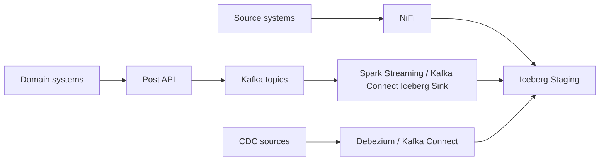
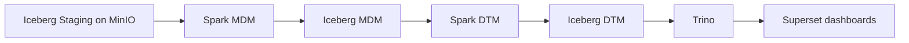
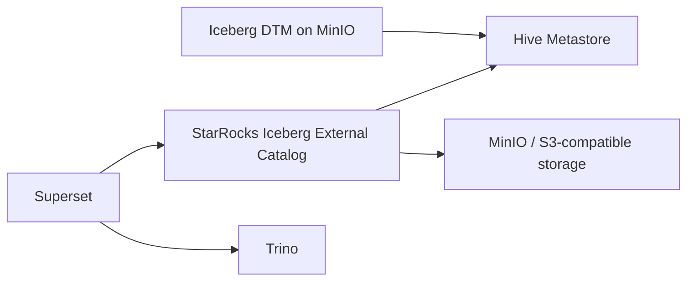
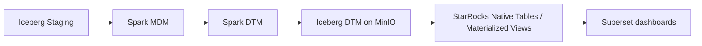
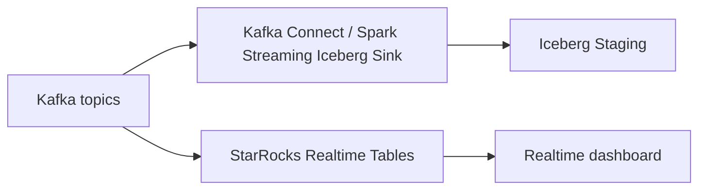
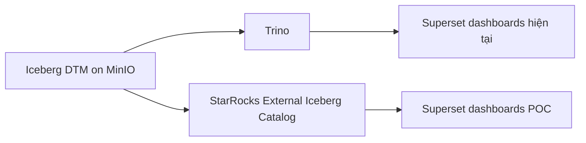
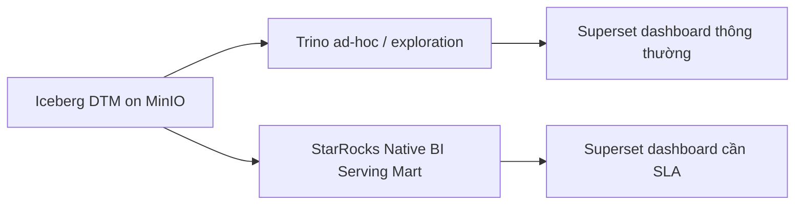
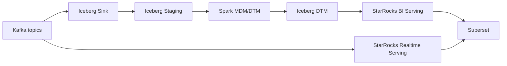
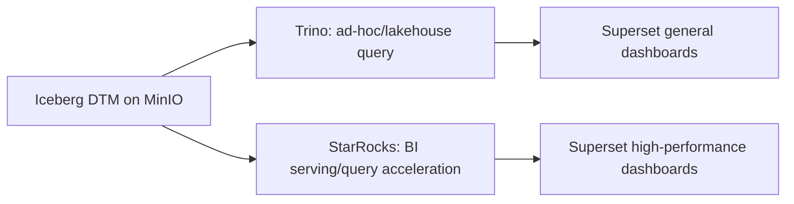

# R&D: Đánh giá StarRocks cho lớp BI Serving và Query Acceleration trên Lakehouse Iceberg

Ngày tạo: 2026-06-14  
Phạm vi: Lakehouse dùng Iceberg, MinIO, Hive Metastore, Trino, Spark, Kafka, NiFi, Debezium, Superset  
Mục tiêu chính: Đánh giá khả năng bổ sung StarRocks vào kiến trúc hiện tại để tăng tốc dashboard/BI, giảm tải query lặp lại, và hỗ trợ một số use case near real-time.

---

## 1. Executive Summary

Hệ thống lakehouse hiện tại đã có đầy đủ các thành phần chính:

- Ingestion qua NiFi, API/Kafka, và một phần CDC/Debezium.
- Dữ liệu được ghi vào Iceberg Staging trên object storage MinIO.
- Tầng MDM và DTM được xử lý bằng Spark.
- Trino đang đóng vai trò query engine để đọc Iceberg/Hive catalog.
- Superset dùng để hiển thị dashboard, nhiều khả năng đang query qua Trino.

StarRocks không nên được nhìn như công nghệ thay thế toàn bộ lakehouse hiện tại. Vai trò phù hợp nhất của StarRocks là:

- Lớp BI serving/query acceleration phía trên DTM.
- Engine phục vụ dashboard có latency thấp và concurrency tốt hơn.
- Lớp native serving mart hoặc materialized view cho các dashboard quan trọng.
- Lớp realtime serving cho một số Kafka topic cần dashboard gần realtime.

Khuyến nghị chính:

1. Không thay Spark MDM/DTM bằng StarRocks trong giai đoạn đầu.
2. Không thay Trino toàn hệ thống ngay.
3. Bắt đầu bằng POC StarRocks đọc trực tiếp Iceberg DTM qua Hive Metastore và MinIO.
4. Sau đó chọn các dashboard chậm hoặc quan trọng để tạo native StarRocks table/materialized view.
5. Chỉ dùng Kafka -> StarRocks cho các use case realtime rõ ràng.

Kết luận sơ bộ: StarRocks phù hợp để nghiên cứu như một lớp bổ sung cho Trino trong workload BI/dashboard, đặc biệt khi hệ thống cần dashboard nhanh hơn, nhiều người dùng đồng thời hơn, hoặc cần pre-aggregate dữ liệu DTM.

---

## 2. Bối cảnh hệ thống hiện tại

### 2.1 Luồng ingestion

Hệ thống hiện tại có 3 nhóm ingestion chính:

1. Source -> NiFi -> Iceberg Staging.
2. Hệ thống chuyên ngành -> Post API -> Kafka topic -> Spark Streaming hoặc Kafka Connect Iceberg Sink -> Iceberg Staging.
3. CDC -> Debezium service/Kafka Connect -> Debezium connector + Kafka Connect Iceberg Sink -> Iceberg Staging. Luồng này ít dùng hơn.

Mô hình tổng quát:



### 2.2 Luồng xử lý dữ liệu

Sau khi dữ liệu vào Iceberg Staging:

- Spark xử lý tầng MDM.
- Spark xử lý tầng DTM.
- Dữ liệu DTM vẫn nằm trên Iceberg/MinIO.
- Superset hiển thị dashboard từ DTM, hiện tại nhiều khả năng thông qua Trino.



### 2.3 Các thành phần nền tảng liên quan

- MinIO: object storage S3-compatible, lưu dữ liệu Iceberg.
- Hive Metastore/Hive Catalog: quản lý metadata/catalog cho Iceberg.
- Iceberg: table format chính của lakehouse.
- Spark: engine chính cho ETL/ELT, MDM, DTM.
- Trino: query engine để query lakehouse/ad-hoc/dashboard.
- Superset: BI/dashboard.
- Kafka: streaming/event backbone.
- Debezium/Kafka Connect: CDC và sink connector.

---

## 3. Vấn đề cần nghiên cứu

R&D này nên tập trung vào các câu hỏi thực tế sau:

1. Dashboard Superset query qua Trino có đang chậm ở một số use case không?
2. Trino có bị tải bởi nhiều query dashboard lặp lại không?
3. Query dashboard có nhiều join/aggregate trên bảng DTM lớn không?
4. Có dashboard nào cần response time thấp, ví dụ dưới 1-3 giây không?
5. Có nhu cầu near real-time dashboard từ Kafka không?
6. Có cần tách workload BI serving khỏi workload ad-hoc/lake query không?
7. StarRocks có đọc được Iceberg DTM hiện tại qua Hive Metastore và MinIO không?
8. Superset có kết nối StarRocks ổn định không?
9. StarRocks external query có hơn Trino không, hay cần native table/materialized view mới tạo ra khác biệt?

Điểm quan trọng: Nếu chỉ dùng StarRocks để đọc Iceberg external catalog giống vai trò Trino, hiệu quả tăng tốc không chắc chắn trong mọi workload. Giá trị lớn hơn của StarRocks thường đến từ native table, cache, materialized view, pre-aggregation, và serving workload được thiết kế riêng cho dashboard.

---

## 4. Mục tiêu R&D

### 4.1 Mục tiêu chính

Đánh giá StarRocks như một lớp BI serving/query acceleration phía trên Iceberg DTM trong kiến trúc lakehouse hiện tại.

### 4.2 Mục tiêu phụ

- Kiểm chứng khả năng StarRocks kết nối Iceberg catalog thông qua Hive Metastore.
- Kiểm chứng khả năng StarRocks đọc dữ liệu Iceberg lưu trên MinIO.
- Kiểm chứng khả năng Superset kết nối StarRocks.
- So sánh query latency giữa Trino và StarRocks trên dashboard/query thực tế.
- Đánh giá khả năng tạo native StarRocks serving table/materialized view từ DTM.
- Đánh giá khả năng ingest Kafka vào StarRocks cho realtime dashboard.
- Xác định rủi ro vận hành, security, data freshness, schema evolution, và chi phí hạ tầng.

### 4.3 Ngoài phạm vi

Các nội dung không nên đưa vào phạm vi R&D giai đoạn đầu:

- Thay thế toàn bộ Spark MDM/DTM.
- Thay thế toàn bộ Trino.
- Chuyển toàn bộ Iceberg lakehouse sang StarRocks.
- Thiết kế lại toàn bộ ingestion pipeline.
- Áp dụng Kafka realtime cho toàn bộ topic.

---

## 5. Tổng quan StarRocks

StarRocks là analytical database/query engine theo kiến trúc MPP, phục vụ các workload OLAP như realtime analytics, ad-hoc analytics, dashboard BI, và data lake analytics.

Theo tài liệu StarRocks latest 4.1, StarRocks có các đặc điểm chính:

- MPP architecture.
- Vectorized execution engine.
- Columnar storage engine.
- Cost-based optimizer.
- Materialized view.
- Hỗ trợ batch và streaming ingestion.
- Có thể phân tích dữ liệu trong data lake mà không cần migrate dữ liệu.
- Tương thích MySQL protocol, thuận tiện cho BI tools.
- Hỗ trợ internal table và external catalog như Iceberg/Hive/Hudi/Delta Lake/JDBC.

Với hệ thống hiện tại, những điểm liên quan nhất là:

- StarRocks hỗ trợ Iceberg external catalog.
- StarRocks hỗ trợ Hive Metastore làm metastore cho Iceberg.
- StarRocks hỗ trợ S3-compatible storage như MinIO.
- Superset có thể kết nối StarRocks qua SQLAlchemy URI.
- Asynchronous materialized view có thể tạo trên external catalog, bao gồm Iceberg catalog.
- Primary Key table hỗ trợ update/delete/upsert tốt hơn cho các use case realtime hoặc CDC serving.

---

## 6. Kiến trúc StarRocks liên quan đến hệ thống hiện tại

StarRocks có 2 nhóm node chính:

- FE (Frontend): nhận connection, quản lý metadata, parse/optimize query, lập execution plan, schedule query.
- BE hoặc CN:
  - BE dùng trong shared-nothing architecture, vừa lưu data local vừa execute query.
  - CN dùng trong shared-data architecture, compute tách storage; data nằm trên object storage/HDFS và CN dùng local cache.

### 6.1 Shared-nothing

Đặc điểm:

- BE lưu dữ liệu local.
- Tối ưu cho latency thấp và query nhanh.
- Phù hợp khi cần performance mạnh cho dashboard serving.
- Cần quản lý replica/storage local.

Phù hợp với:

- Native StarRocks serving mart.
- Dashboard hot cần response nhanh.
- Dữ liệu BI đã được pre-aggregate hoặc denormalize.

### 6.2 Shared-data

Đặc điểm:

- Tách compute và storage.
- Data nằm trên object storage như MinIO/S3.
- CN cache hot data local.
- Scale compute linh hoạt hơn.

Phù hợp với:

- Môi trường cloud-native/object storage.
- Cần scale compute nhanh.
- Muốn tận dụng MinIO/object storage.

### 6.3 Gợi ý cho R&D

Trong POC ban đầu, có thể ưu tiên triển khai đơn giản:

- FE + BE nếu dùng shared-nothing/native table.
- FE + CN/shared-data nếu muốn thử mô hình tách compute-storage.

Tuy nhiên, do mục tiêu R&D là kiểm chứng tích hợp với Iceberg/MinIO/HMS/Superset trước, không nên làm phức tạp kiến trúc StarRocks ngay từ đầu. Nên bắt đầu từ deployment tối thiểu đủ để test.

---

## 7. Vị trí StarRocks trong kiến trúc hiện tại

Có 3 phương án tích hợp chính.

---

## 8. Phương án A: StarRocks đọc trực tiếp Iceberg DTM

### 8.1 Mô tả

StarRocks được triển khai song song với Trino. StarRocks tạo Iceberg external catalog trỏ tới Hive Metastore và đọc dữ liệu Iceberg đang nằm trên MinIO.



### 8.2 Mục tiêu

- Kiểm chứng StarRocks đọc được dữ liệu DTM hiện tại.
- Kiểm chứng Superset query StarRocks.
- So sánh StarRocks với Trino trên cùng bảng Iceberg.
- Không duplicate dữ liệu.
- Không thay đổi pipeline Spark hiện tại.

### 8.3 Cấu hình concept

Ví dụ cấu hình catalog dạng tham khảo:

```sql
CREATE EXTERNAL CATALOG iceberg_dtm
PROPERTIES
(
    "type" = "iceberg",
    "iceberg.catalog.type" = "hive",
    "hive.metastore.uris" = "thrift://hive-metastore:9083",
    "aws.s3.enable_ssl" = "false",
    "aws.s3.enable_path_style_access" = "true",
    "aws.s3.endpoint" = "http://minio:9000",
    "aws.s3.access_key" = "<access_key>",
    "aws.s3.secret_key" = "<secret_key>"
);
```

Lưu ý:

- Cần kiểm tra chính xác property theo version StarRocks triển khai.
- StarRocks FE/BE/CN phải reach được Hive Metastore.
- StarRocks BE/CN phải reach được MinIO.
- Nếu dùng hostname nội bộ, cần DNS/hosts/network policy đúng.
- Nếu MinIO dùng TLS/self-signed cert, cần cấu hình SSL/certificate tương ứng.

### 8.4 Ưu điểm

- Ít thay đổi nhất.
- Phù hợp POC nhanh.
- Không cần copy dữ liệu.
- Có thể rollback về Trino dễ dàng.
- Giữ Iceberg DTM là source of truth.

### 8.5 Nhược điểm

- Chưa chắc nhanh hơn Trino trong mọi query.
- Query vẫn phụ thuộc object storage throughput và layout file Iceberg.
- Nếu DTM có nhiều small files, StarRocks cũng bị ảnh hưởng.
- Nếu dashboard query lặp lại nhiều aggregate/join nặng, external query đơn thuần có thể chưa đủ.

### 8.6 Khi nào nên dùng

- Muốn kiểm chứng tích hợp nhanh.
- Muốn dùng StarRocks song song với Trino.
- Muốn test dashboard thật mà không tạo data copy.
- Dashboard không quá nặng hoặc cần tăng tốc vừa phải.

### 8.7 Kết luận phương án A

Phương án A rất phù hợp làm bước POC đầu tiên. Tuy nhiên không nên kỳ vọng đây là phương án tối ưu cuối cùng cho dashboard quan trọng. Nếu benchmark chưa đạt, cần chuyển sang phương án B.

---

## 9. Phương án B: StarRocks làm native BI serving mart

### 9.1 Mô tả

StarRocks đọc dữ liệu từ Iceberg DTM rồi lưu một phần dữ liệu vào native StarRocks table hoặc materialized view. Superset query vào các bảng native này để có latency tốt hơn.



### 9.2 Mục tiêu

- Tối ưu dashboard hot.
- Giảm query lặp lại vào Trino/MinIO.
- Tạo serving model phù hợp với Superset.
- Tận dụng materialized view, partition, bucket, sort key, colocate join nếu cần.

### 9.3 Các kiểu triển khai

#### 9.3.1 Native table từ DTM

Tạo bảng native trong StarRocks và load dữ liệu từ Iceberg DTM:

```sql
CREATE TABLE ads_revenue_daily (
    report_date DATE NOT NULL,
    province_code VARCHAR(32),
    product_group VARCHAR(128),
    revenue DECIMAL(18,2),
    order_count BIGINT
)
DUPLICATE KEY(report_date, province_code, product_group)
PARTITION BY date_trunc('day', report_date)
DISTRIBUTED BY HASH(province_code);

INSERT INTO ads_revenue_daily
SELECT
    report_date,
    province_code,
    product_group,
    revenue,
    order_count
FROM iceberg_dtm.dtm.ads_revenue_daily;
```

#### 9.3.2 Aggregate table hoặc pre-aggregated mart

Dùng cho dashboard chủ yếu group by theo ngày/tháng/khu vực/sản phẩm:

```sql
CREATE TABLE mart_revenue_monthly (
    month_key DATE NOT NULL,
    province_code VARCHAR(32),
    product_group VARCHAR(128),
    revenue DECIMAL(18,2),
    order_count BIGINT
)
DUPLICATE KEY(month_key, province_code, product_group)
PARTITION BY date_trunc('month', month_key)
DISTRIBUTED BY HASH(province_code);
```

#### 9.3.3 Asynchronous materialized view trên Iceberg external catalog

Tạo materialized view trong StarRocks dựa trên bảng Iceberg external catalog:

```sql
CREATE MATERIALIZED VIEW mv_revenue_daily
DISTRIBUTED BY HASH(province_code)
REFRESH ASYNC EVERY (INTERVAL 1 HOUR)
AS
SELECT
    report_date,
    province_code,
    product_group,
    SUM(revenue) AS revenue,
    COUNT(*) AS record_count
FROM iceberg_dtm.dtm.fact_revenue
GROUP BY report_date, province_code, product_group;
```

Lưu ý:

- Materialized view là physical table chứa kết quả pre-compute.
- Có thể refresh manual hoặc async theo lịch.
- Với external catalog, StarRocks không luôn đảm bảo nhận biết mọi thay đổi ngay lập tức ở nguồn ngoài, nên cần thiết kế refresh rõ ràng.
- Nên partition MV theo cùng logic với DTM để refresh incremental/partition-level.

### 9.4 Ưu điểm

- Khả năng tăng tốc dashboard cao nhất.
- Giảm tải Trino, Hive Metastore, MinIO cho query dashboard lặp lại.
- Có thể thiết kế schema riêng cho Superset.
- Có thể pre-aggregate dữ liệu theo KPI.
- Có thể kiểm soát data freshness bằng lịch refresh.

### 9.5 Nhược điểm

- Có thêm bản copy dữ liệu.
- Cần cơ chế refresh/sync.
- Cần xử lý schema evolution từ Iceberg sang StarRocks.
- Cần vận hành thêm storage/cluster StarRocks.
- Cần governance rõ: Iceberg DTM là source of truth, StarRocks là serving copy.

### 9.6 Khi nào nên dùng

- Dashboard query chậm qua Trino.
- Query dashboard lặp lại nhiều.
- Nhiều user cùng xem dashboard.
- KPI chủ yếu aggregate theo chiều cố định.
- Cần SLA dashboard rõ ràng.

### 9.7 Kết luận phương án B

Đây là phương án có giá trị thực tế nhất nếu mục tiêu là tăng tốc dashboard. Phương án A dùng để kiểm chứng tích hợp; phương án B dùng để tạo hiệu quả performance rõ ràng.

---

## 10. Phương án C: StarRocks realtime serving từ Kafka

### 10.1 Mô tả

Một số Kafka topic quan trọng được ingest song song vào Iceberg Staging và StarRocks. Iceberg vẫn là lakehouse source of truth, còn StarRocks phục vụ realtime dashboard.



### 10.2 Mục tiêu

- Dashboard gần realtime.
- Không phải chờ Spark MDM/DTM batch hoặc micro-batch.
- Tách realtime serving khỏi lakehouse transform chính.

### 10.3 Các kiểu ingest

StarRocks hỗ trợ nhiều hình thức load dữ liệu:

- Routine Load từ Kafka.
- Kafka connector.
- Flink connector.
- Spark connector.
- Stream Load.
- Broker Load/Pipe/Insert cho batch hoặc object storage.

Với Kafka realtime, hướng thường dùng là:

- Append-only event: Routine Load/Kafka connector vào Duplicate Key table.
- Upsert/update/delete: Primary Key table.
- CDC/Debezium: cần mapping operation insert/update/delete rõ ràng.

### 10.4 Ví dụ Primary Key table cho realtime serving

```sql
CREATE TABLE rt_order_status (
    order_id BIGINT NOT NULL,
    event_time DATETIME NOT NULL,
    customer_id BIGINT,
    status VARCHAR(64),
    amount DECIMAL(18,2),
    updated_at DATETIME
)
PRIMARY KEY(order_id)
DISTRIBUTED BY HASH(order_id)
ORDER BY(event_time)
PROPERTIES (
    "enable_persistent_index" = "true"
);
```

### 10.5 Ưu điểm

- Latency thấp hơn flow qua Iceberg -> Spark -> DTM.
- Phù hợp monitoring/operational dashboard.
- Primary Key table phù hợp với dữ liệu có update/delete.

### 10.6 Nhược điểm

- Dễ tạo 2 đường dữ liệu song song.
- Cần kiểm soát consistency giữa Iceberg và StarRocks.
- Cần xử lý late event, duplicate event, out-of-order event.
- CDC/Debezium phức tạp hơn append-only.
- Không nên áp dụng cho tất cả Kafka topic.

### 10.7 Khi nào nên dùng

- Có dashboard cần dữ liệu gần realtime.
- Dữ liệu topic có schema ổn định.
- KPI realtime không yêu cầu logic DTM quá phức tạp.
- Có thể chấp nhận StarRocks là realtime serving store, còn Iceberg là source of truth dài hạn.

### 10.8 Kết luận phương án C

Phương án C khả thi nhưng nên để sau. Chỉ nên chọn 1-2 topic thật sự cần realtime để POC. Không nên mở rộng đại trà trước khi có governance và consistency strategy.

---

## 11. So sánh StarRocks và Trino trong kiến trúc hiện tại

| Tiêu chí | Trino | StarRocks |
|---|---|---|
| Vai trò chính | Federated query, ad-hoc query, lakehouse query | BI serving, OLAP acceleration, realtime analytics |
| Đọc Iceberg | Rất phù hợp, phổ biến | Hỗ trợ Iceberg external catalog |
| Đọc MinIO/S3-compatible | Có | Có |
| Hive Metastore | Có | Có |
| Superset integration | Có | Có, qua StarRocks SQLAlchemy URI |
| Dashboard latency thấp | Tùy workload và layout Iceberg | Tốt hơn khi dùng native table/MV |
| Query concurrency BI | Có thể được nhưng dễ gây tải lake | Phù hợp hơn nếu thiết kế serving layer |
| Materialized view | Không phải điểm mạnh cốt lõi | Điểm mạnh, có async MV/query rewrite |
| Native storage tối ưu BI | Không | Có |
| Kafka realtime ingestion | Không phải trọng tâm | Có nhiều cơ chế load/stream |
| CDC/upsert serving | Không phải trọng tâm | Primary Key table phù hợp hơn |
| Thay Spark ETL | Không | Không nên trong giai đoạn đầu |
| Thay Iceberg source of truth | Không | Không nên |
| Điểm mạnh nhất | Query linh hoạt nhiều nguồn | Serving nhanh, MV, native OLAP, realtime analytics |

Kết luận:

- Trino vẫn nên giữ cho ad-hoc query, data exploration, federation, và query trực tiếp lakehouse.
- StarRocks nên bổ sung cho dashboard serving, query acceleration, native mart, và một số realtime use case.
- Không nên coi đây là lựa chọn "Trino hoặc StarRocks". Hướng hợp lý hơn là "Trino và StarRocks, mỗi engine phục vụ workload khác nhau".

---

## 12. Kiến trúc đề xuất sau R&D

### 12.1 Kiến trúc mục tiêu ngắn hạn



Mục tiêu:

- Không phá flow hiện tại.
- Superset có thêm connection StarRocks.
- Test một số dashboard bằng StarRocks.

### 12.2 Kiến trúc mục tiêu trung hạn



Mục tiêu:

- Trino giữ workload linh hoạt.
- StarRocks phục vụ dashboard quan trọng.
- DTM vẫn là source of truth.

### 12.3 Kiến trúc mục tiêu dài hạn nếu có realtime



Mục tiêu:

- Batch/curated analytics vẫn đi qua Iceberg/Spark/DTM.
- Realtime dashboard đọc trực tiếp từ StarRocks realtime tables.
- Superset có thể dùng cả serving mart và realtime mart.

---

## 13. Thiết kế POC đề xuất

### 13.1 POC 1: StarRocks external Iceberg catalog

Mục tiêu:

- Kết nối StarRocks tới Hive Metastore.
- Đọc Iceberg DTM trên MinIO.
- Chạy query cơ bản và query dashboard.

Checklist:

- Deploy StarRocks test cluster.
- Cấu hình network tới Hive Metastore.
- Cấu hình access MinIO.
- Tạo Iceberg external catalog.
- `SHOW DATABASES` trong catalog.
- `SHOW TABLES`.
- Query `SELECT COUNT(*)`.
- Query filter theo partition.
- Query aggregate.
- Query join 2-3 bảng DTM.

Success criteria:

- StarRocks đọc được bảng DTM.
- Query không lỗi permission/network.
- Latency có thể đo được và so sánh với Trino.
- Superset có thể tạo dataset từ StarRocks.

### 13.2 POC 2: Superset integration

Mục tiêu:

- Kết nối Superset với StarRocks.
- Rebuild hoặc clone một số dashboard đang dùng Trino để chạy qua StarRocks.

Connection URI tham khảo:

```text
starrocks://<User>:<Password>@<Host>:<Port>/<Catalog>.<Database>
```

Checklist:

- Cài Python client/driver StarRocks trên Superset nếu cần.
- Tạo database connection StarRocks.
- Tạo dataset từ external Iceberg catalog.
- Chạy chart đơn giản.
- Chạy dashboard thật.
- So sánh với dashboard qua Trino.

Success criteria:

- Superset query StarRocks ổn định.
- Dashboard chạy được mà không cần sửa logic lớn.
- Có số đo latency trước/sau.

### 13.3 POC 3: Native serving mart/materialized view

Mục tiêu:

- Tạo bảng native hoặc MV cho 2-3 dashboard quan trọng.
- So sánh performance với Trino và external Iceberg query.

Checklist:

- Chọn 2-3 dashboard chậm nhất hoặc quan trọng nhất.
- Liệt kê các bảng DTM liên quan.
- Liệt kê query SQL thực tế từ Superset/Trino.
- Thiết kế native table/MV trong StarRocks.
- Load dữ liệu từ Iceberg DTM.
- Thiết kế refresh schedule.
- Chạy benchmark.

Success criteria:

- Dashboard latency giảm rõ rệt.
- Data freshness đáp ứng SLA.
- Refresh không gây tải quá lớn.
- Storage tăng thêm ở mức chấp nhận được.

### 13.4 POC 4: Kafka realtime serving, nếu cần

Mục tiêu:

- Kiểm chứng khả năng ingest Kafka vào StarRocks cho một realtime dashboard.

Checklist:

- Chọn 1 topic đơn giản, schema ổn định.
- Xác định event type: append-only hay upsert/delete.
- Chọn table type: Duplicate Key hoặc Primary Key.
- Cấu hình Routine Load/Kafka connector.
- Tạo dashboard realtime trong Superset.
- So sánh latency với flow qua Iceberg/Spark.

Success criteria:

- End-to-end latency đạt yêu cầu.
- Không mất dữ liệu/duplicate ngoài kỳ vọng.
- Có strategy xử lý replay và late event.

---

## 14. Bộ benchmark đề xuất

### 14.1 Nhóm chỉ số query

- Query latency P50/P90/P95/P99.
- Dashboard load time.
- Query throughput.
- Concurrent users: 5, 10, 30, 50 users.
- CPU/memory/network/disk I/O của StarRocks.
- Tải lên MinIO/Hive Metastore.
- Query failure rate.

### 14.2 Nhóm chỉ số data freshness

- Thời gian từ DTM hoàn tất đến StarRocks thấy dữ liệu.
- Thời gian refresh MV/native mart.
- Độ trễ realtime Kafka -> StarRocks nếu test phương án C.

### 14.3 Nhóm chỉ số vận hành

- Thời gian deploy.
- Độ phức tạp cấu hình catalog/storage.
- Khả năng monitor.
- Khả năng scale.
- Khả năng backup/restore.
- Cách rollback về Trino.

### 14.4 Query benchmark nên chọn

Nên lấy query thật từ Superset/Trino thay vì query giả. Chia thành các nhóm:

1. Simple scan/filter theo partition.
2. Aggregate theo ngày/tháng/khu vực.
3. Join fact với dimension.
4. Top N.
5. Distinct count.
6. Dashboard query chạy lặp lại nhiều.
7. Dashboard query chậm nhất hiện tại.

Ví dụ template ghi kết quả:

| Query | Engine | Mode | P50 | P95 | P99 | Data scanned | Notes |
|---|---|---|---:|---:|---:|---:|---|
| Q1 revenue daily | Trino | Iceberg external | TBD | TBD | TBD | TBD | Baseline |
| Q1 revenue daily | StarRocks | Iceberg external | TBD | TBD | TBD | TBD | POC A |
| Q1 revenue daily | StarRocks | Native/MV | TBD | TBD | TBD | TBD | POC B |

---

## 15. Data modeling trong StarRocks

### 15.1 Nguyên tắc chọn bảng đưa vào StarRocks

Không nên copy toàn bộ DTM vào StarRocks ngay. Chỉ chọn:

- Bảng phục vụ dashboard quan trọng.
- Bảng được query nhiều.
- Bảng có aggregate/join lặp lại.
- Bảng có SLA thấp.
- Bảng có dữ liệu hot gần đây.

### 15.2 Gợi ý table type

| Use case | Table type gợi ý |
|---|---|
| Event append-only | Duplicate Key table |
| KPI pre-aggregated | Duplicate Key hoặc Aggregate table |
| Dữ liệu cần upsert/update/delete | Primary Key table |
| CDC/realtime serving | Primary Key table |
| Dimension table nhỏ | Duplicate Key hoặc Primary Key |
| Fact table lớn phục vụ dashboard | Duplicate Key, partition theo thời gian |

### 15.3 Partition

Nên partition theo thời gian nếu dashboard thường filter theo ngày/tháng:

- `report_date`
- `event_date`
- `created_date`
- `month_key`

Nguyên tắc:

- Partition không quá nhỏ gây quá nhiều partition.
- Partition không quá lớn làm refresh chậm.
- Cùng logic partition với DTM nếu cần incremental refresh.

### 15.4 Distribution/bucketing

Chọn hash key theo:

- Column join phổ biến.
- Dimension filter phổ biến.
- Cardinality đủ tốt.
- Tránh skew.

Ví dụ:

- `customer_id`
- `province_code`
- `merchant_id`
- `product_id`

### 15.5 Sort key

Với Primary Key table, StarRocks cho phép sort key tách khỏi primary key ở các version mới. Nên chọn sort key theo filter phổ biến:

- `event_date`
- `report_date`
- `province_code`
- `merchant_id`

---

## 16. Data freshness và refresh strategy

### 16.1 Với external Iceberg catalog

Dữ liệu được đọc trực tiếp từ Iceberg. Data freshness phụ thuộc:

- Iceberg commit đã hoàn tất chưa.
- Hive Metastore/catalog metadata đã cập nhật chưa.
- StarRocks có nhìn thấy metadata mới chưa.
- Cache/metadata refresh policy.

### 16.2 Với native table

Cần job sync từ DTM sang StarRocks:

- Full refresh theo ngày.
- Incremental refresh theo partition.
- Insert overwrite partition nếu phù hợp.
- Append incremental nếu dữ liệu không update.
- Upsert nếu dùng Primary Key table.

### 16.3 Với materialized view

Cần xác định:

- Refresh manual hay async theo lịch.
- Refresh full hay partition-level.
- Refresh interval: 5 phút, 15 phút, 1 giờ, hàng ngày.
- Có cần refresh ngay sau Spark DTM job hoàn tất không.

Khuyến nghị:

- Dashboard quản trị thông thường: refresh 1-4 lần/ngày hoặc sau DTM job.
- Dashboard vận hành: refresh 5-15 phút/lần.
- Dashboard realtime: dùng Kafka -> StarRocks, không phụ thuộc DTM.

---

## 17. Vận hành và hạ tầng

### 17.1 Thành phần cần vận hành

- StarRocks FE.
- StarRocks BE hoặc CN.
- Storage local cho BE/CN cache.
- Network access tới Hive Metastore.
- Network access tới MinIO.
- Superset driver/connection.
- Monitoring/alerting.

### 17.2 HA cơ bản

Production nên có:

- Nhiều FE để tránh single point of failure.
- Nhiều BE/CN để scale query và đảm bảo availability.
- Backup metadata/config.
- Resource isolation cho query dashboard và refresh job nếu cần.

### 17.3 Monitoring

Cần monitor:

- FE health.
- BE/CN health.
- Query latency.
- Query queue.
- Failed query.
- Load/refresh job status.
- MV refresh status.
- CPU/memory/disk/network.
- MinIO request/error/latency.
- Hive Metastore latency/error.

### 17.4 Security

Cần kiểm tra:

- User/role trong StarRocks.
- Quyền truy cập external catalog.
- Credential MinIO.
- TLS giữa service nếu có.
- Secret management.
- Audit query nếu yêu cầu governance.
- Mapping quyền từ Superset user tới StarRocks nếu cần row/column-level control.

### 17.5 Backup/restore

Với phương án A:

- Không có data copy trong StarRocks, chủ yếu backup config/catalog/user.

Với phương án B/C:

- Cần backup native table hoặc chấp nhận rebuild từ Iceberg/Kafka.
- Cần định nghĩa RTO/RPO cho serving layer.
- Nếu StarRocks chỉ là serving copy, có thể rebuild từ DTM để đơn giản hóa backup.

---

## 18. Rủi ro và giới hạn

### 18.1 Rủi ro kỹ thuật

- StarRocks external Iceberg query chưa chắc nhanh hơn Trino trên mọi workload.
- Small files trong Iceberg có thể làm cả Trino và StarRocks chậm.
- Query trên object storage phụ thuộc throughput/latency MinIO.
- Hive Metastore có thể thành điểm nghẽn metadata.
- Materialized view trên external catalog cần chiến lược refresh rõ để tránh stale data.
- Schema evolution từ Iceberg sang StarRocks native table có thể cần xử lý thủ công.
- CDC/Debezium vào StarRocks cần mapping operation cẩn thận.

### 18.2 Rủi ro vận hành

- Thêm một cluster cần vận hành.
- Thêm monitoring, alerting, backup, capacity planning.
- Cần đào tạo team vận hành/query tuning.
- Cần phân quyền và quản lý credential MinIO/HMS.

### 18.3 Rủi ro dữ liệu

- Native StarRocks table có thể lệch dữ liệu với Iceberg DTM nếu refresh lỗi.
- Realtime StarRocks có thể lệch với batch DTM nếu logic transform khác nhau.
- Late event/out-of-order event có thể làm KPI realtime khác KPI DTM.

### 18.4 Cách giảm rủi ro

- Giữ Iceberg DTM là source of truth.
- StarRocks chỉ là serving layer.
- Có dashboard/data quality check so sánh StarRocks với Trino/DTM.
- Có rollback path: Superset dashboard có thể chuyển lại Trino.
- POC trên dashboard thật trước khi production.
- Chỉ mở rộng native mart sau khi có benchmark rõ.

---

## 19. Lộ trình triển khai đề xuất

### Phase 0: Chuẩn bị

Thời gian: 1-2 tuần.

Việc cần làm:

- Chọn version StarRocks.
- Chọn môi trường test.
- Xác định 3-5 dashboard/query dùng benchmark.
- Lấy baseline từ Trino.
- Chuẩn bị thông tin Hive Metastore, MinIO endpoint, credential, network.

Deliverable:

- Danh sách query benchmark.
- Baseline Trino.
- Sơ đồ kết nối.

### Phase 1: External Iceberg Catalog POC

Thời gian: 1-2 tuần.

Việc cần làm:

- Deploy StarRocks test.
- Tạo Iceberg external catalog.
- Đọc DTM tables.
- Query benchmark.
- Connect Superset.

Deliverable:

- Kết quả StarRocks external vs Trino.
- Danh sách lỗi/tương thích.
- Khuyến nghị có tiếp tục Phase 2 không.

### Phase 2: Native serving mart/MV POC

Thời gian: 2-4 tuần.

Việc cần làm:

- Chọn dashboard hot.
- Thiết kế native table/MV.
- Load dữ liệu từ Iceberg DTM.
- Thiết kế refresh.
- Benchmark Superset dashboard.

Deliverable:

- Kết quả performance trước/sau.
- Data freshness report.
- Storage/cost estimate.
- Khuyến nghị production.

### Phase 3: Production hardening

Thời gian: 3-6 tuần tùy hạ tầng.

Việc cần làm:

- HA FE/BE hoặc FE/CN.
- Monitoring/alerting.
- Security/role/credential.
- Backup/rebuild strategy.
- CI/CD cho schema và refresh SQL.
- Runbook vận hành.

Deliverable:

- Production architecture.
- Runbook.
- SLA/SLO.
- Dashboard monitoring.

### Phase 4: Realtime Kafka POC, nếu cần

Thời gian: 2-4 tuần.

Việc cần làm:

- Chọn topic realtime.
- Chọn table type.
- Cấu hình load từ Kafka.
- Tạo realtime dashboard.
- Đối soát với Iceberg/DTM.

Deliverable:

- Realtime latency report.
- Consistency strategy.
- Khuyến nghị mở rộng hoặc dừng.

---

## 20. Tiêu chí quyết định Go/No-Go

### Go nếu

- StarRocks đọc được Iceberg DTM ổn định qua HMS/MinIO.
- Superset kết nối và query ổn định.
- Dashboard native/MV nhanh hơn đáng kể so với Trino.
- Refresh dữ liệu đáp ứng SLA.
- Chi phí vận hành chấp nhận được.
- Có rollback path rõ ràng.

### No-Go hoặc Delay nếu

- Không đọc ổn định Iceberg/MinIO/HMS.
- Performance external không hơn Trino và native/MV không đủ lợi ích.
- Refresh quá phức tạp hoặc dễ lệch dữ liệu.
- Team chưa có năng lực vận hành thêm cluster.
- Use case dashboard chưa có vấn đề latency/concurrency rõ ràng.

### Decision matrix

| Điều kiện | Khuyến nghị |
|---|---|
| Chỉ muốn query lakehouse linh hoạt | Giữ Trino |
| Dashboard chậm nhưng không muốn duplicate data | Thử StarRocks external catalog |
| Dashboard quan trọng cần nhanh | StarRocks native table/MV |
| Dashboard realtime từ Kafka | StarRocks realtime table |
| Transform MDM/DTM phức tạp | Giữ Spark |
| Source of truth lakehouse | Giữ Iceberg |

---

## 21. Khuyến nghị cuối cùng

StarRocks phù hợp nhất với vai trò bổ sung trong kiến trúc hiện tại:



Không nên triển khai StarRocks theo hướng thay thế toàn bộ Trino hoặc Spark. Hướng triển khai hợp lý:

1. StarRocks external Iceberg catalog để POC nhanh.
2. Native StarRocks serving mart/materialized view cho dashboard hot.
3. Kafka realtime serving cho một số use case thật sự cần realtime.

Kết luận: nên đưa StarRocks vào R&D với mục tiêu rõ là "BI serving và query acceleration cho Superset trên nền Iceberg DTM", không phải "thay thế lakehouse".

---

## 22. Appendix A: Ví dụ Superset connection

URI tham khảo:

```text
starrocks://admin:<password>@starrocks-fe:9030/iceberg_dtm.dtm
```

Trong đó:

- `admin`: user StarRocks.
- `starrocks-fe`: host FE.
- `9030`: FE query port.
- `iceberg_dtm`: catalog trong StarRocks.
- `dtm`: database/schema trong Iceberg catalog.

---

## 23. Appendix B: Ví dụ checklist kỹ thuật khi POC

### Network

- StarRocks FE reach Hive Metastore.
- StarRocks BE/CN reach MinIO.
- Superset reach StarRocks FE query port.
- DNS/hostname service resolve được giữa các namespace/network.

### Credential

- MinIO access key/secret key.
- Hive Metastore access nếu có auth.
- StarRocks user/password.
- Superset database connection secret.

### Data

- Chọn bảng DTM có partition.
- Chọn bảng fact lớn.
- Chọn dimension table.
- Chọn dashboard/query thực tế.

### Test

- `SHOW CATALOGS`.
- `SHOW DATABASES FROM iceberg_dtm`.
- `SHOW TABLES FROM iceberg_dtm.dtm`.
- `SELECT COUNT(*)`.
- Query filter partition.
- Query join.
- Query aggregate.
- Query từ Superset.

---

## 24. Appendix C: Nguồn tham khảo chính

- StarRocks introduction: https://docs.starrocks.io/docs/introduction/StarRocks_intro/
- StarRocks architecture: https://docs.starrocks.io/docs/introduction/Architecture/
- StarRocks Iceberg catalog: https://docs.starrocks.io/docs/data_source/catalog/iceberg/iceberg_catalog/
- StarRocks loading options: https://docs.starrocks.io/docs/loading/Loading_intro/
- StarRocks asynchronous materialized views: https://docs.starrocks.io/docs/using_starrocks/async_mv/Materialized_view/
- StarRocks Primary Key table: https://docs.starrocks.io/docs/table_design/table_types/primary_key_table/
- StarRocks Superset integration: https://docs.starrocks.io/docs/integrations/BI_integrations/Superset/

